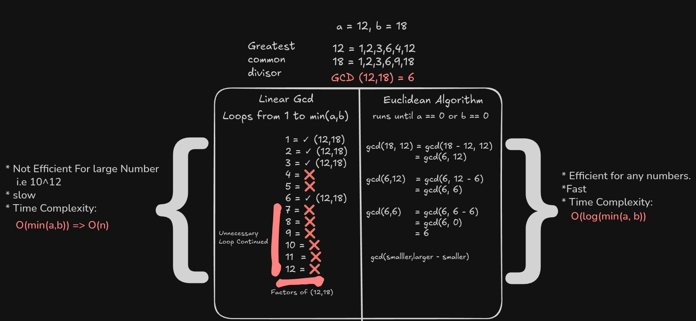

GCD is the largest positive integer that divides two or more integers without leaving a remainder.

For example: the GCD of 12 and 18 is 6. 6 divides both 12 and 18 without leaving a remainder.

**Brute Force Approach (linearGCD):**
- Iterates through all numbers from 1 to the minimum of the two numbers.
- Checks if they divide both numbers without leaving a remainder.
- Time complexity: O(min(a, b)), which is not efficient for large numbers.

**Euclidean Algorithm:**
- More efficient, with time complexity O(log(min(a, b))).
- Works well even for large numbers.

**How the Euclidean algorithm works:**
1. If b is 0, then the GCD is a.
2. Otherwise, recursively call the function with b and a % b.
3. Repeat until b becomes 0; at that point, a is the GCD.

